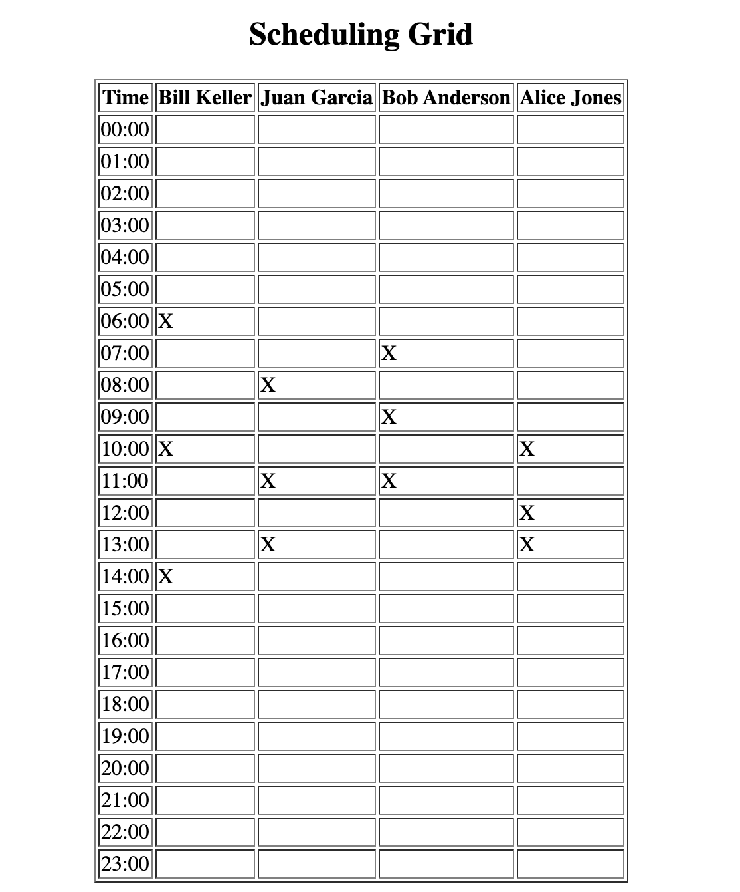
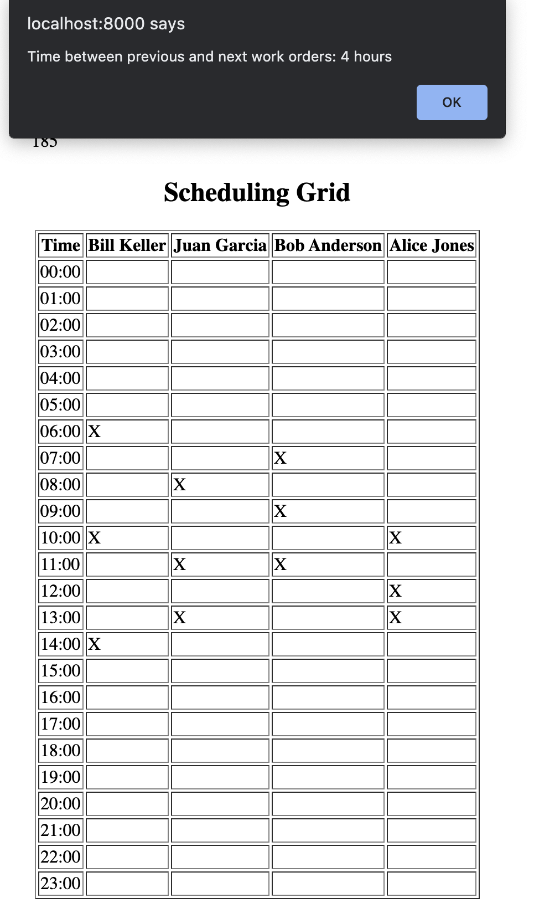

## Background and Approaches taken

### Backend
This application works through the use of a Django backend, combined with a PostgreSQL database. I created a database with the location, technician, and work_orders tables, using the provided csv files. Reading of the files was done by the csv library and is done on each page reload; to avoid creating objects every time, I used Django's get_or_create function, which simply gets the database object if it exists already (for example - if technician Alice Jones already exists, the webpage simply retrives and discards it).

For the work_order database model, I used a foreign key for location_id and technician_id to represent a many-to-one relationship, since one work order has only one location/technician, but one technician/location can possibly have many work orders.

In the views side, I decided to represent the table with a 24 hour time. This meant that I had to convert each technician's work_order datetime to an HH:MM format before checking the number of hours between two consecutive work orders. 

I used a dictionary data structure to represent each hour of the day, with an inner dictionary specifying each technician's status. For example - 6: {technician1: '', technician2: 'X', ....}. This states that at 6 AM technician 2 has a work order whereas technician 1 is free. I created this kind of structure to make it easy for printing the table in the format requested in the requirements i.e. time, technician1, technician2, etc. Passing this dictionary into the django template allowed me to simply loop over the keys and values and print the table row and table data cell elements of the table with ease.

Using Django templates, I passed the database objects to the html file, created a table with it, and used jQuery to calculate the time between shifts for technicians.

### Frontend

I attached the jQuery cdn to the home.html django template to make selecting of table elements easy. I wrote a getColumn helper function, which returns an array of the entire table column. I attached an onclick listener to each td element, generated its row and index, and, looped through the entire column, checking for X's backwards and forwards. Whenever we find an X, whether it be backwards or forwards, save the index of the array in a beforeTime or afterTime variable; if no X is found, use the variables' default value (1 for beforeTime and 24 for afterTime, which means that the technican is completely free). Finally, I displayed the net free time using an alert, with the value afterTime - beforeTime. 

### Why Django?
I wanted to finish this assignment as quickly as possible, but using ruby on rails would require me to learn ruby and then get myself comfortable with rails, which is a pretty complete framework, requiring some time to acquaint myself with. Thus, I decided to use Django, which seemed right for this job and also a framework I am very comfortable with.

The development process went very smoothly, espcially on the backend side. For the frontend, I had to spend some time understanding how to loop through and select cells of a table. Designing the scheduling object also took some time, as I experimented with different structures to represent the table with. For instance, I tried to use a structure like: technician1: {0: '', 1: '', ...}; however, this didn't let me create the table like I wanted to, as a table requires:
    
    row
        time
        technican1
        technician2
    endrow

Thus, breaking down the table according to row made me realize that I had to represent my dictionary object according to time keys with each technician being a value, yet also being a dictionary (i.e a 2D dictionary).

Overall, this was a very fun project to work on, and I learnt quite a lot!

## Running Examples

Clicking on the 11:00 cell for Bill Keller

## HOW TO USE

1. Initialize a postgreSQL database and server on your computer
2. Download the source code and set database credentials in settings.py using environment variables (TERRIER_DB_NAME (the database name), TERRIER_DB_USER (database username), and TERRIER_DB_PASSWORD (database password)) 
3. Make sure you have a csvs folder with the location, technicians, and work_orders csv files inside the scheduler directory (scheduler/csvs/locations.csv, technicians.csv, etc). The file names must match exactly.
4. Type the command python manage.py runserver to start the webserver and navigate to localhost:8000
